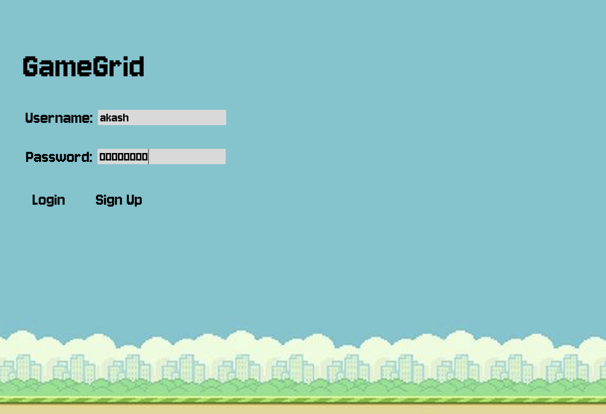
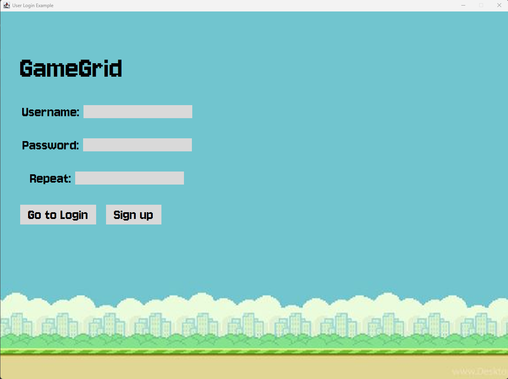
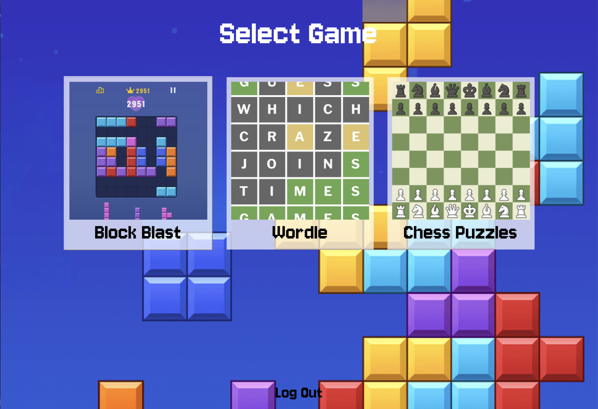

# GameGrid

A Java-based gaming platform featuring multiple puzzle games with user authentication, leaderboards, and progress tracking.

## Overview

GameGrid is a desktop application that provides a unified platform for playing multiple puzzle games. Users can create accounts, track their scores, compete on leaderboards, and enjoy three different game modes: Wordle, Block Blast, and Chess Puzzles.

## User Stories & Responsibilities

### Nathan
- As a user, I want to log in, log out, and create an account so that I can access my personalized game data.
- As a user, I want to navigate between different games from a single game menu so that accessing games is easy and fast.

### Bill
- As a user, I want to place block pieces and clear full lines to get a high score.

### Akash
- As a user, I want to play Wordle on repeat, easily starting a new game whenever I win, lose or give up.
- As a user, I want to be able to navigate back to the game menu whenever, to easily switch games.
- As a user, I want to navigate to a separate leaderboard for each different game to track stats.

### Kai
- As a user, I want to track my personal best scores so that I can monitor my progress.
- As a user, I want to view leaderboards so that I can compare my performance with other users.
- As a user, I want to see a leaderboard for each different game, so I can see which users are the best at each game independently.

### James
- As a user, I want to be able to solve chess puzzles that match my level.
- As a user, I want to be able to see possible moves of their chess pieces.

### Stephen
- As a user, I want to be able to move the pieces in the chess puzzle game.

## APIs Used
### 1. Rapid API
This API was used to generate the chess puzzles used for the Chess Puzzle game as it provided the moves needed to solve it, and ELO rating difficulty.

### 2. MongoDB API
It is user database that contains usernames, hashed passwords, and information about each of the players including their highscores. The API itself is a database that stores data in JSON-like documents


## Games

### 1. Wordle
Classic word-guessing game where players have 6 attempts to guess a 5-letter word. Color-coded feedback helps narrow down the correct answer.

**Features:**
- On-screen keyboard
- Real-time letter validation
- Score tracking based on wins
- Word list validation

### 2. Block Blast
Tetris-inspired puzzle game where players place pieces on an 8×8 grid to clear rows and columns.

**Features:**
- Drop pieces placement
- Line clearing mechanics
- Progressive difficulty
- Score accumulation

### 3. Chess Puzzles
Solve tactical chess positions with move validation and hints.

**Features:**
- Difficulty levels based on ELO rating
- Move validation with visual feedback
- Solution viewer with animations
- ELO-based scoring system
- Piece dragging and legal move highlighting
- Chess notation support


## Running the Application from IDE
- **IntelliJ IDEA**: Run `Main.java` or `MainMongoDB.java` after entering credentials.

## Architecture

GameGrid follows Clean Architecture principles with clear separation of concerns:
```
src/main/java/
├── app/                   # Application builders and main entry points
├── entity/                # Core entities
├── use_case/              # Use case interactors
├── interface_adapter/     # Controllers, presenters, and view models
├── data_access/           # Data access objects and API integrations
└── view/                  # UI components and panels
```


## Screenshots

### Login Screen


### Sign Up Screen


### Game Menu


### Wordle


### Block Blast


### Chess Puzzles


### Leaderboard


## Project Structure
```
GameGrid/
├── src/
│   ├── main/
│   │   ├── java/
│   │   │   ├── app/              # Application entry points
│   │   │   ├── data_access/      # Data persistence
│   │   │   ├── entity/           # Domain entities
│   │   │   ├── interface_adapter/# Controllers and presenters
│   │   │   ├── use_case/         # Core logic
│   │   │   ├── view/             # UI components
│   │   │   └── wordle/           # Wordle-specific UI
│   │   └── resources/
│   │       ├── fonts/            # Custom fonts
│   │       ├── images/           # Game assets
│   │       └── wordlists/        # Wordle word lists
│   └── test/                     # Unit tests
├── pom.xml                       # Maven configuration
└── README.md                     # This file
```

## Acknowledgments

- Chess puzzle data provided by [RapidAPI Chess Puzzles API](https://rapidapi.com/KeeghanM/api/chess-puzzles)
- Wordle word lists from NYT Wordle
- Jersey10 font for UI typography
- MongoDB Atlas for cloud database hosting
