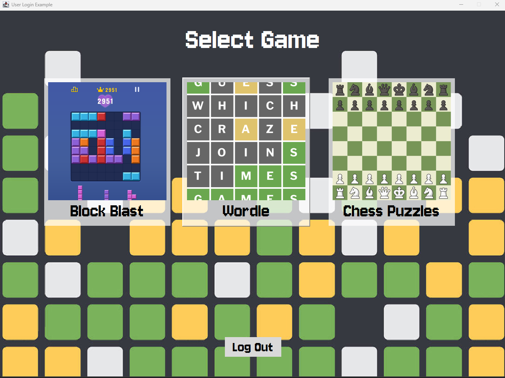
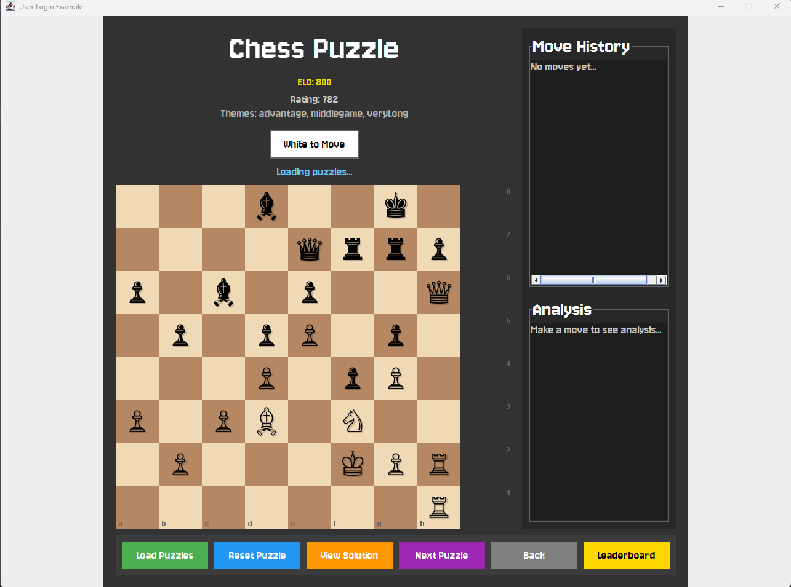
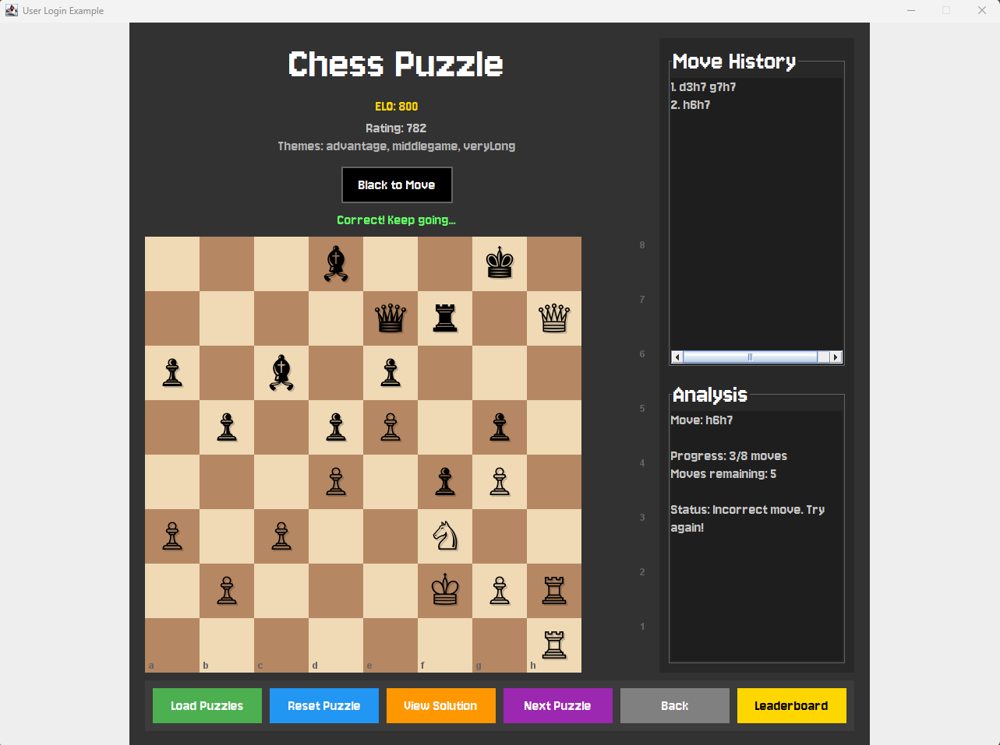

# Team Project

## **Summary of Application:**
- Our application is a game platform for users to create accounts and track their points in comparison to other players in 3 games: Block Blast, Wordle, and Chess Puzzles.
- The application starts with a login screen where users are able to make a new account or login into their pre-existing account.
- They will have all 3 games available to play with unlimited attempts, with a leaderboard of the high scores of all users

## User Stories & Who Was Responsible
- Nathan
  - As a user, I want to log in, log out, and create an account so that I can access my personalized game data. 
  - As a user, I want to navigate between different games from a single game menu so that accessing games is easy and fast.
- Bill
  - As a user, I want to place block piece and clear full lines to get a high score.
- Akash
  - As a user, I want to play Wordle on repeat, easily starting a new game whenever I win, lose or give up.
  - As a user, I want to be able to navigate back to the game menu whenever, to easily switch games. 
  - As a user, I want to navigate to a separate leaderboard for each different game to track stats.
- Kai
  - As a user, I want to track my personal best scores so that I can monitor my progress.
  - As a user, I want to view leaderboards so that I can compare my performance with other users.
  - As a user, I want to see a leaderboard for each different game, so I can see which users are the best at each game independently.
- James
  - As a user, I want to be able to solve chess puzzles that matches my level.
  - As a user, I want to be able to see possible moves of their chess pieces.
- Stephen
  - As a user, I want to be able to move the pieces in the chess puzzle game.

## APIs Used
- MongoDB -> It is user database that contains usernames, hashed passwords, and information about each of the players including their highscores. The API itself is a database that stores data in JSON-like documents
- RapidAPI -> This API was used to generate the chess puzzles used for the Chess Puzzle game as it provided the board state, moves needed to solve it, and difficulty.

Screenshots of our program are provided below.

